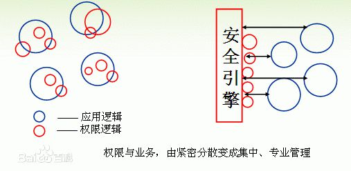
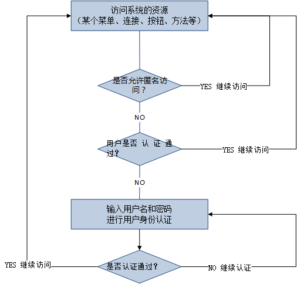
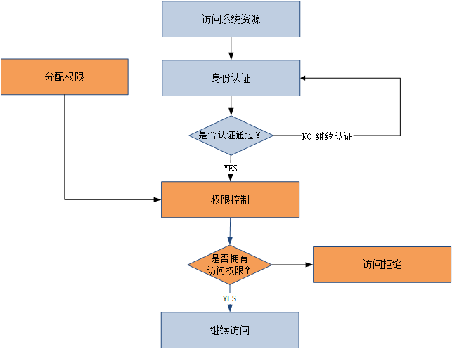

## 权限管理
本文主要讨论在 B/S 架构下实现权限管理，且以权限力度的维度对权限分类：功能权限、数据权限。

#### 权限模型
* RBAC（Role Based Access Control）

* 数据库设计
    * 5张表：用户表、用户角色关联表、角色表、角色资源关联表、资源表（或权限表）。
    * 其中资源表：
        * 区分文件夹和文件，即非具体的请求和具体的请求（前者为不发起具体请求的菜单、按钮、超链接、页面或模块等）；
        * 新增列表示资源英文标识（如resource_name_en:itemmanager/itemmanager-additem/..），用以前端做显示与隐藏页面元素或是否发起请求（区域加载）的判断；
        * 权限点（所有行记录，包括文件夹和文件）构建起来的权限树，是以用户行为路径为依赖关系的（换句话，用户在页面操作的先后顺序直接影响权限点的依赖关系）。所以权限点的依赖关系很容易受到产品模型（用户操作流程的变更）而变化。

* 产品需求改动（用户体验流程变动）
    * 直接影响权限点的依赖关系的变动。
    * 由开发人员（前后端开发）来根据产品体验流程维护权限点的依赖关系，产品或运营只使用目标权限功能。为了让体验更好（产品或运营等操作人员更清楚知道隐藏的权限点的启用），可以将非直接的或隐藏依赖的权限点的启停用变化弹框告知操作人员、

* 代码改动
    * 如果是功能/菜单权限，只需要维护数据库的权限点的依赖关系即可。
    * 如果是数据权限，或需要调整数据权限模型。

#### 权限校验
[基于角色的权限控制在springMVC框架中的实现](https://my.oschina.net/wnjustdoit/blog/1605700)

#### 其它拓展
* 用户身份认证
* 密码加密
* 通信协议 https

#### 参考资料
* 权限管理：https://baike.baidu.com/item/%E6%9D%83%E9%99%90%E7%AE%A1%E7%90%86/151530
* RBAC
    > - https://csrc.nist.gov/CSRC/media/Publications/conference-paper/1992/10/13/role-based-access-controls/documents/ferraiolo-kuhn-92.pdf
    > - https://csrc.nist.gov/projects/role-based-access-control
    > - https://zh.wikipedia.org/wiki/%E4%BB%A5%E8%A7%92%E8%89%B2%E7%82%BA%E5%9F%BA%E7%A4%8E%E7%9A%84%E5%AD%98%E5%8F%96%E6%8E%A7%E5%88%B6
* Spring Security
    > - 官网地址：https://docs.spring.io/spring-security/site/docs/5.2.0.BUILD-SNAPSHOT/reference/htmlsingle/
    > - 描述：Spring Security is a framework that provides authentication, authorization, and protection against common attacks.
* 权限集中管理

* 用户认证流程

* 授权流程



```
NOTES:

B/S、C/S
to B、to C
web端、移动端、小程序、支付宝窗口、桌面端
对内（CMS等内部用户）、对外（公开用户）
自主注册、代注册

用户/账号：
账号类型：
管理员账号（root、admin等为特殊的具有最高权限的管理员账号）、普通账号
账号状态：
禁用、停用、启用

角色：
角色是对权限的分组（一般以职位分组）

模型设计：
无限级的树
文件夹（菜单、按钮、超链接、页面等）、文件（具体请求）

权限匹配：
spring 对 rest 的支持
spring 请求映射与查找、AntMatch、排除法特例（模糊匹配和精确查找）

权限展示与配置：
zTree 树形结构

维护：
需求变更：权限依赖关系、包含关系变更
代码变更：请求信息变更
数据库变更：数据权限


难点：
、前端界面元素的显示与隐藏（菜单、按钮、超链接、页面或模块等）
、权限点的依赖关系
、数据权限的设计

解决方案：
、文件夹和文件的思想
、以用户访问路径为标准，构建权限点访问路径树
、还是以权限组（角色）的思想，此时资源表可能是具体的数据或字段名了

问题：针对以下场景，怎么设计权限模型。
张三对所有商品有修改的权限？
张三对所有商品仅部分字段（如标题、描述）有修改的权限？
张三只对奶粉类的商品有修改权限？
张三只对某些商品的某些字段有某些权限？

```
